# Phase IV Architecture Documentation

## Overview

Phase IV transforms the Phase III Todo Chatbot from a standalone application into a cloud-native, containerized application running on Kubernetes. This document details the architectural decisions, components, and deployment topology.

## Table of Contents

- [Architecture Goals](#architecture-goals)
- [Technology Stack](#technology-stack)
- [System Architecture](#system-architecture)
- [Container Architecture](#container-architecture)
- [Kubernetes Deployment Architecture](#kubernetes-deployment-architecture)
- [Network Architecture](#network-architecture)
- [Data Persistence Architecture](#data-persistence-architecture)
- [Resource Allocation](#resource-allocation)
- [Comparison with Phase III](#comparison-with-phase-iii)
- [Evolution to Phase V](#evolution-to-phase-v)

---

## Architecture Goals

Phase IV serves as a bridge between standalone deployment (Phase III) and cloud production (Phase V):

1. **Containerization**: Package applications in Docker for consistency across environments
2. **Orchestration**: Use Kubernetes for automated deployment, scaling, and management
3. **Local Development**: Enable developers to run production-like environments locally
4. **Scalability**: Support horizontal scaling with multiple pod replicas
5. **Resilience**: Implement health checks and automatic restart policies
6. **Persistence**: Maintain data across pod restarts using persistent volumes
7. **Package Management**: Use Helm for templated, version-controlled deployments

---

## Technology Stack

### Infrastructure

| Component | Technology | Version | Purpose |
|-----------|-----------|---------|---------|
| Container Runtime | Docker | 20.10+ | Container image building and execution |
| Orchestrator | Kubernetes | 1.28+ | Container orchestration and management |
| Local Cluster | Minikube | 1.30+ | Local Kubernetes development environment |
| Package Manager | Helm | 3.10+ | Kubernetes package management |
| Configuration | Kustomize | Built-in | Environment-specific customization |

### Application Stack

| Layer | Technology | Version | Purpose |
|-------|-----------|---------|---------|
| Backend Language | Python | 3.12 | Application runtime |
| Backend Framework | FastAPI | 0.104+ | REST API framework |
| AI Integration | OpenAI SDK | 1.3+ | GPT-4 integration |
| Frontend Framework | React | 18+ | UI framework |
| Frontend Build | Vite | 5+ | Build tooling |
| Frontend Server | Nginx | Alpine | Static file serving |
| Database | SQLite | 3.x | Data persistence |
| ORM | SQLAlchemy | 2.0+ | Database abstraction |

---

## System Architecture

### High-Level Architecture

```mermaid
graph TB
    subgraph "User Layer"
        User[👤 User]
        Browser[🌐 Web Browser]
    end

    subgraph "Infrastructure Layer"
        subgraph "Minikube Cluster"
            subgraph "Control Plane"
                APIServer[API Server]
                Scheduler[Scheduler]
                Controller[Controller Manager]
            end

            subgraph "Data Plane"
                Node[Worker Node<br/>Minikube]
            end
        end
    end

    subgraph "Application Layer"
        subgraph "todo-chatbot Namespace"
            Frontend[Frontend Pods<br/>Nginx + React]
            Backend[Backend Pods<br/>FastAPI + Python]
            Data[Persistent Storage<br/>SQLite DB]
            Config[Configuration<br/>Secrets + ConfigMaps]
        end
    end

    subgraph "External Services"
        OpenAI[☁️ OpenAI API<br/>GPT-4]
    end

    User --> Browser
    Browser --> Node
    Node --> Frontend
    Frontend --> Backend
    Backend --> Data
    Backend --> Config
    Backend --> OpenAI

    APIServer -.->|Schedule| Node
    Scheduler -.->|Manage| Node
    Controller -.->|Control| Node

    style Frontend fill:#4CAF50
    style Backend fill:#2196F3
    style Data fill:#FF9800
    style Config fill:#9C27B0
    style OpenAI fill:#FFC107
```



### Component Relationships


---

## Container Architecture

### Backend Container

**Image**: `todo-chatbot-backend:latest`

**Multi-Stage Build Process:**

```
Stage 1: Builder
├── Base: python:3.12-slim
├── Install: build-essential, git
├── Copy: requirements.txt
└── Install: Python dependencies

Stage 2: Runtime
├── Base: python:3.12-slim
├── Copy: Dependencies from builder
├── Copy: Application code
├── User: non-root (UID 1000)
├── Workdir: /app
├── Expose: 8001
├── Healthcheck: GET /health
└── CMD: uvicorn main:app
```

**Dockerfile Structure:**
```dockerfile
# Stage 1: Builder
FROM python:3.12-slim AS builder
WORKDIR /app
COPY phase-3-chatbot/backend/requirements.txt .
RUN pip install --no-cache-dir -r requirements.txt

# Stage 2: Runtime
FROM python:3.12-slim
WORKDIR /app
COPY --from=builder /usr/local/lib/python3.12/site-packages /usr/local/lib/python3.12/site-packages
COPY phase-3-chatbot/backend/ .
RUN useradd -u 1000 -m appuser && chown -R appuser:appuser /app
USER appuser
EXPOSE 8001
HEALTHCHECK --interval=30s --timeout=3s --start-period=40s --retries=3 \
  CMD curl -f http://localhost:8001/health || exit 1
CMD ["uvicorn", "main:app", "--host", "0.0.0.0", "--port", "8001"]
```

**Image Size Optimization:**
- Multi-stage build: Removes build tools from final image
- Slim base images: Minimal OS footprint
- No-cache pip install: Reduces layer size
- Final image size: ~200MB

### Frontend Container

**Image**: `todo-chatbot-frontend:latest`

**Multi-Stage Build Process:**

```
Stage 1: Builder
├── Base: node:20
├── Workdir: /app
├── Copy: package.json, package-lock.json
├── Install: npm dependencies
├── Copy: Source code
├── Build: npm run build (Vite)
└── Output: /app/dist

Stage 2: Runtime
├── Base: nginx:alpine
├── Copy: Build output from builder
├── Copy: Custom nginx.conf
├── Expose: 80
└── CMD: nginx -g 'daemon off;'
```

**Dockerfile Structure:**
```dockerfile
# Stage 1: Builder
FROM node:20 AS builder
WORKDIR /app
COPY phase-3-chatbot/frontend/package*.json ./
RUN npm ci
COPY phase-3-chatbot/frontend/ .
ARG VITE_API_URL=http://localhost:8001
ENV VITE_API_URL=${VITE_API_URL}
RUN npm run build

# Stage 2: Runtime
FROM nginx:alpine
COPY --from=builder /app/dist /usr/share/nginx/html
COPY phase-4-local-deployment/docker/frontend/nginx.conf /etc/nginx/conf.d/default.conf
EXPOSE 80
HEALTHCHECK --interval=30s --timeout=3s --start-period=10s --retries=3 \
  CMD wget --no-verbose --tries=1 --spider http://localhost/health || exit 1
CMD ["nginx", "-g", "daemon off;"]
```

**Nginx Configuration:**
```nginx
server {
    listen 80;
    server_name _;
    root /usr/share/nginx/html;
    index index.html;

    # SPA routing - fallback to index.html
    location / {
        try_files $uri $uri/ /index.html;
    }

    # Health check endpoint
    location /health {
        access_log off;
        return 200 "healthy\n";
        add_header Content-Type text/plain;
    }

    # Caching for static assets
    location ~* \.(js|css|png|jpg|jpeg|gif|ico|svg|woff|woff2)$ {
        expires 1y;
        add_header Cache-Control "public, immutable";
    }
}
```

**Image Size Optimization:**
- Two-stage build: Separates build tools from runtime
- Alpine base: Minimal Linux distribution (~5MB)
- Static asset compression: Vite builds optimized bundles
- Final image size: ~40MB

---

## Kubernetes Deployment Architecture

### Namespace Organization

```
todo-chatbot (Namespace)
├── Deployments
│   ├── todo-chatbot-backend (2 replicas)
│   └── todo-chatbot-frontend (2 replicas)
├── Services
│   ├── todo-chatbot-backend (ClusterIP)
│   └── todo-chatbot-frontend (NodePort)
├── Storage
│   └── todo-chatbot-data (PersistentVolumeClaim)
├── Configuration
│   ├── todo-chatbot-config (ConfigMap)
│   └── todo-chatbot-secret (Secret)
└── Resources
    └── Labels: app=todo-chatbot, environment=local
```

### Backend Deployment

```yaml
apiVersion: apps/v1
kind: Deployment
metadata:
  name: todo-chatbot-backend
  namespace: todo-chatbot
spec:
  replicas: 2
  selector:
    matchLabels:
      app: todo-chatbot-backend
  strategy:
    type: RollingUpdate
    rollingUpdate:
      maxUnavailable: 1
      maxSurge: 1
  template:
    metadata:
      labels:
        app: todo-chatbot-backend
    spec:
      containers:
      - name: backend
        image: todo-chatbot-backend:latest
        imagePullPolicy: IfNotPresent
        ports:
        - containerPort: 8001
        env:
        - name: DATABASE_URL
          valueFrom:
            configMapKeyRef:
              name: todo-chatbot-config
              key: DATABASE_URL
        - name: OPENAI_API_KEY
          valueFrom:
            secretKeyRef:
              name: todo-chatbot-secret
              key: OPENAI_API_KEY
        volumeMounts:
        - name: data
          mountPath: /app/data
        resources:
          requests:
            memory: "256Mi"
            cpu: "250m"
          limits:
            memory: "512Mi"
            cpu: "500m"
        livenessProbe:
          httpGet:
            path: /health
            port: 8001
          initialDelaySeconds: 30
          periodSeconds: 10
        readinessProbe:
          httpGet:
            path: /health
            port: 8001
          initialDelaySeconds: 10
          periodSeconds: 5
      volumes:
      - name: data
        persistentVolumeClaim:
          claimName: todo-chatbot-data
```

**Key Features:**
- **Replicas**: 2 pods for high availability
- **Rolling Updates**: Zero-downtime deployments
- **Health Checks**: Automatic restart on failure
- **Resource Limits**: Prevent resource exhaustion
- **Volume Mounts**: Persistent data storage

### Frontend Deployment

```yaml
apiVersion: apps/v1
kind: Deployment
metadata:
  name: todo-chatbot-frontend
  namespace: todo-chatbot
spec:
  replicas: 2
  selector:
    matchLabels:
      app: todo-chatbot-frontend
  template:
    spec:
      containers:
      - name: frontend
        image: todo-chatbot-frontend:latest
        imagePullPolicy: IfNotPresent
        ports:
        - containerPort: 80
        resources:
          requests:
            memory: "128Mi"
            cpu: "100m"
          limits:
            memory: "256Mi"
            cpu: "200m"
        livenessProbe:
          httpGet:
            path: /health
            port: 80
          initialDelaySeconds: 10
          periodSeconds: 10
        readinessProbe:
          httpGet:
            path: /health
            port: 80
          initialDelaySeconds: 5
          periodSeconds: 5
```

---

## Network Architecture

### Service Types and Routing


### DNS Resolution

**Internal Service Discovery:**
```
Frontend → Backend Communication:
  URL: http://todo-chatbot-backend:8001
  FQDN: todo-chatbot-backend.todo-chatbot.svc.cluster.local

Explanation:
  - Service name: todo-chatbot-backend
  - Namespace: todo-chatbot
  - Domain: svc.cluster.local
  - Kubernetes DNS (CoreDNS) resolves to ClusterIP
```

### Network Policies (Future Enhancement)

Currently, all pods in the namespace can communicate freely. Phase V will add network policies to restrict traffic.

---

## Data Persistence Architecture

### Persistent Volume Lifecycle


### Storage Configuration

**PersistentVolumeClaim (PVC):**
```yaml
apiVersion: v1
kind: PersistentVolumeClaim
metadata:
  name: todo-chatbot-data
  namespace: todo-chatbot
spec:
  accessModes:
    - ReadWriteOnce
  storageClassName: standard
  resources:
    requests:
      storage: 1Gi
```

**Storage Class (Minikube Default):**
```yaml
apiVersion: storage.k8s.io/v1
kind: StorageClass
metadata:
  name: standard
provisioner: k8s.io/minikube-hostpath
reclaimPolicy: Delete
volumeBindingMode: Immediate
```

**Database Location:**
- **Path in Container**: `/app/data/todo.db`
- **Volume Mount**: PVC mounted at `/app/data`
- **Persistence**: Survives pod restarts
- **Scope**: Shared by all backend pod replicas (ReadWriteOnce)

**Note**: SQLite with ReadWriteOnce means only one pod can write at a time. For true multi-replica writes, Phase V will migrate to PostgreSQL.

---

## Resource Allocation

### Pod Resource Requirements

| Component | Requests | Limits | Replicas | Total Resources |
|-----------|----------|--------|----------|-----------------|
| Backend | 256Mi / 250m | 512Mi / 500m | 2 | 512Mi-1Gi / 500m-1000m |
| Frontend | 128Mi / 100m | 256Mi / 200m | 2 | 256Mi-512Mi / 200m-400m |
| **Total** | **384Mi / 350m** | **768Mi / 700m** | **4** | **768Mi-1.5Gi / 700m-1.4** |

### Minikube Resource Allocation

**Recommended Configuration:**
```bash
minikube start --cpus=2 --memory=4096 --disk-size=20g
```

**Resource Breakdown:**
- **Total Memory**: 4Gi
  - Kubernetes System: ~1.5Gi
  - Application Pods: ~1.5Gi (total limits)
  - Buffer: ~1Gi

- **Total CPU**: 2 cores
  - Kubernetes System: ~0.5 cores
  - Application Pods: ~1.4 cores (total limits)
  - Buffer: ~0.1 cores

### Autoscaling (Future)

Phase V will add Horizontal Pod Autoscaler (HPA):
```yaml
apiVersion: autoscaling/v2
kind: HorizontalPodAutoscaler
metadata:
  name: todo-chatbot-backend
spec:
  scaleTargetRef:
    apiVersion: apps/v1
    kind: Deployment
    name: todo-chatbot-backend
  minReplicas: 2
  maxReplicas: 10
  metrics:
  - type: Resource
    resource:
      name: cpu
      target:
        type: Utilization
        averageUtilization: 70
```

---

## Comparison with Phase III

| Aspect | Phase III | Phase IV | Improvement |
|--------|-----------|----------|-------------|
| **Deployment** | Manual `npm start`, `uvicorn` | Kubernetes manifests/Helm | Automated, reproducible |
| **Scaling** | Single instance only | Multiple pod replicas | High availability |
| **Resilience** | Manual restart | Auto-restart via liveness probes | Self-healing |
| **Resource Mgmt** | No limits | CPU/memory requests and limits | Predictable performance |
| **Persistence** | Local filesystem | PersistentVolumes | Survives pod restarts |
| **Networking** | localhost:3000, localhost:8001 | Kubernetes Services | Load balancing |
| **Configuration** | .env files | ConfigMaps and Secrets | Centralized, secure |
| **Portability** | Environment-specific | Containerized | Run anywhere |
| **Updates** | Stop, rebuild, restart | Rolling updates | Zero downtime |

---

## Evolution to Phase V

Phase IV serves as a stepping stone to Phase V (Cloud Production). Key differences:

| Aspect | Phase IV (Local) | Phase V (Cloud Production) |
|--------|------------------|----------------------------|
| **Cluster** | Minikube (local) | DOKS (DigitalOcean Kubernetes) |
| **Database** | SQLite (file-based) | PostgreSQL (managed service) |
| **Events** | None | Kafka (Redpanda Cloud) |
| **Service Mesh** | None | Dapr runtime |
| **Ingress** | NodePort | NGINX Ingress Controller |
| **TLS** | None | Let's Encrypt certificates |
| **Monitoring** | None | Prometheus + Grafana |
| **Logging** | stdout | ELK Stack |
| **CI/CD** | None | GitHub Actions |
| **Secrets** | Kubernetes Secrets | Dapr Secret Store |
| **State** | PersistentVolume | Dapr State Store |

### Phase V Architecture Preview


**Key Phase V Enhancements:**
1. **Event-Driven Architecture**: Kafka for async communication
2. **Dapr Runtime**: Standardized microservices building blocks
3. **Managed Services**: Cloud-native databases and message queues
4. **Production Monitoring**: Metrics, logging, tracing
5. **CI/CD Pipeline**: Automated testing and deployment
6. **Security**: TLS encryption, secret management, RBAC
7. **Scalability**: Auto-scaling based on load

---

## Summary

Phase IV architecture achieves:
- ✅ **Containerization**: Docker images for consistent deployment
- ✅ **Orchestration**: Kubernetes for automated management
- ✅ **Local Development**: Minikube for realistic testing
- ✅ **High Availability**: Multiple replicas with health checks
- ✅ **Data Persistence**: Persistent volumes for SQLite
- ✅ **Configuration Management**: Secrets and ConfigMaps
- ✅ **Package Management**: Helm charts for versioning

This foundation enables smooth transition to Phase V cloud production with minimal architectural changes.

---

## Reference Documentation

- **Deployment Guide**: [../README.md](../README.md)
- **Troubleshooting**: [TROUBLESHOOTING.md](TROUBLESHOOTING.md)
- **Scripts Documentation**: [../scripts/README.md](../scripts/README.md)
- **Kubernetes Manifests**: [../k8s/base/](../k8s/base/)
- **Helm Charts**: [../helm/todo-chatbot/](../helm/todo-chatbot/)
- **Dockerfiles**: [../docker/](../docker/)
