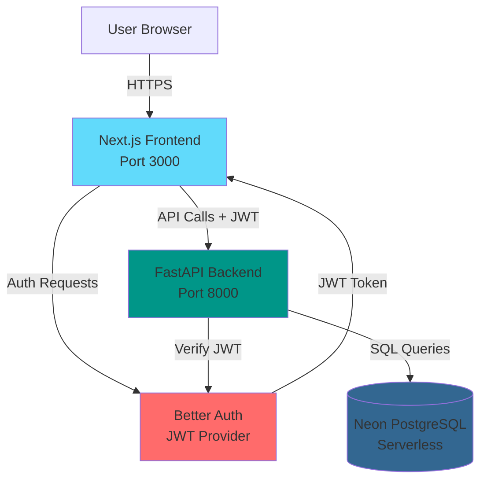
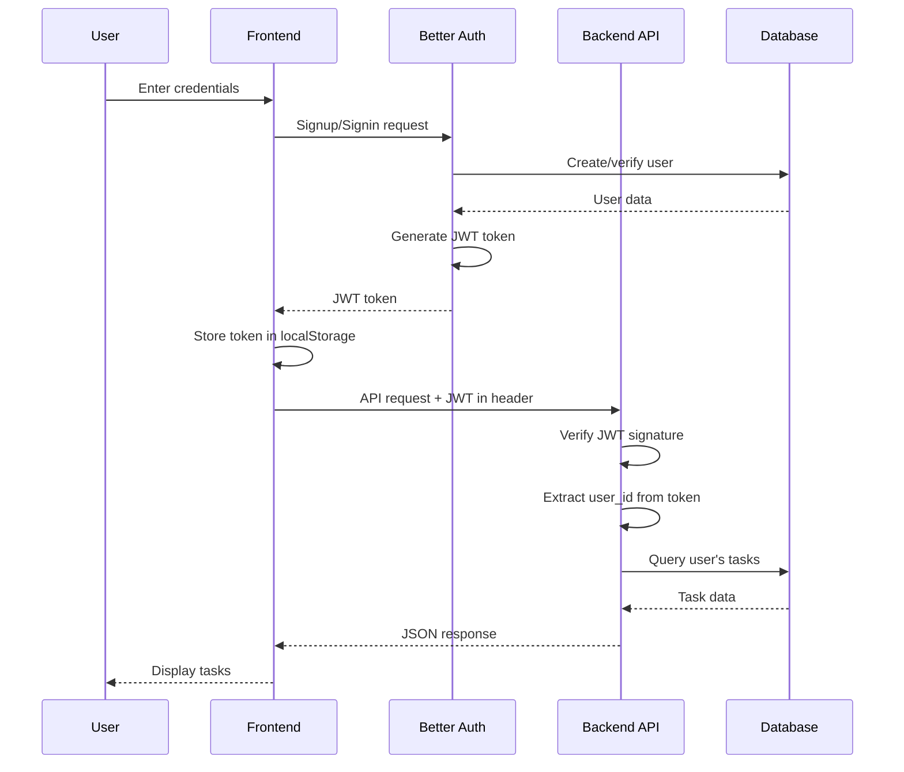
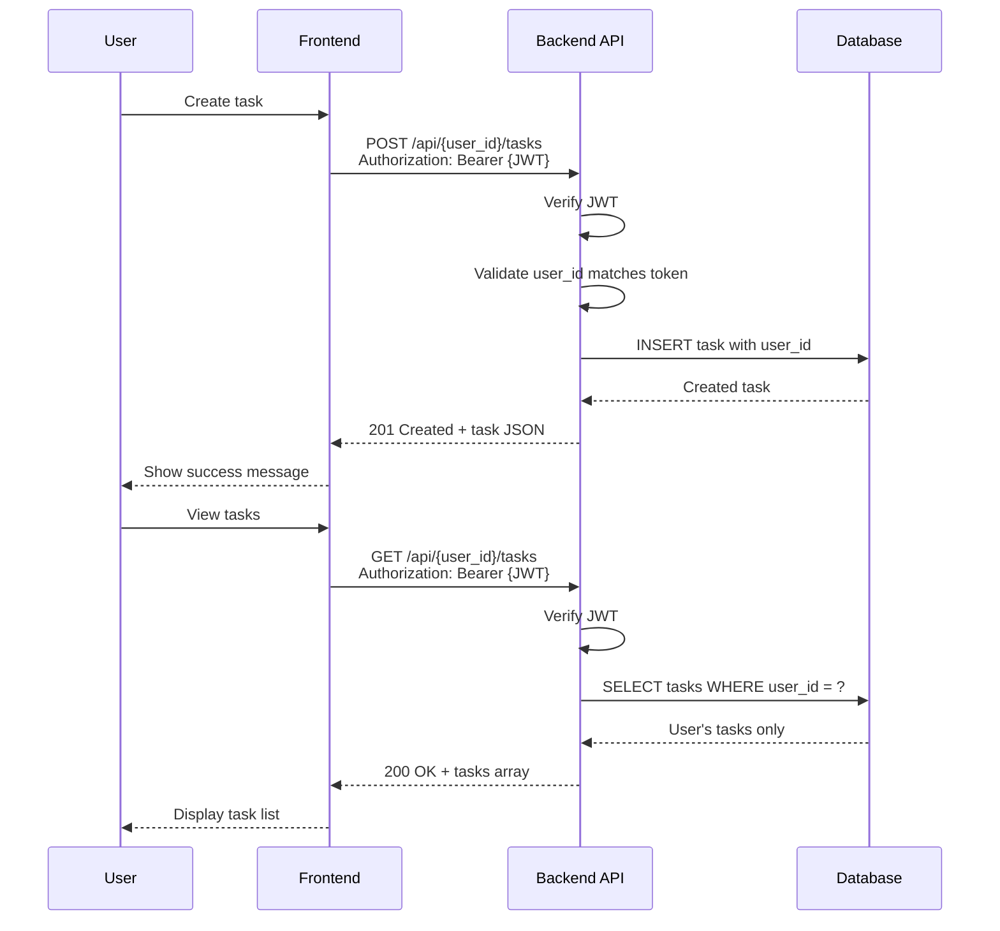

# System Architecture

## High-Level Architecture



## Component Interaction

### Authentication Flow



### Task CRUD Flow



## Data Flow

### Request Flow
1. **User Action** → User interacts with frontend UI
2. **Frontend Validation** → Client-side validation and state management
3. **API Call** → Frontend sends HTTP request with JWT token
4. **Authentication** → Backend verifies JWT signature and extracts user_id
5. **Authorization** → Backend ensures user_id in URL matches token
6. **Business Logic** → Backend processes request with validation
7. **Database Query** → Backend queries/modifies data with user isolation
8. **Response** → Backend returns JSON response
9. **UI Update** → Frontend updates UI with new data

### Security Layers
1. **HTTPS** → All communication encrypted
2. **JWT Token** → Stateless authentication
3. **User Isolation** → Database queries filtered by user_id
4. **CORS** → Only allowed origins can access API
5. **Input Validation** → Both frontend and backend validate inputs
6. **SQL Injection Prevention** → SQLModel ORM with parameterized queries

## Technology Decisions

### Frontend: Next.js 16+ (App Router)
**Rationale:**
- Server-side rendering for better SEO and performance
- App Router for modern React patterns
- Built-in API routes for Better Auth
- TypeScript support out of the box
- Excellent developer experience

### Backend: FastAPI
**Rationale:**
- High performance (async/await support)
- Automatic API documentation (Swagger UI)
- Type safety with Pydantic
- Easy JWT integration
- Python ecosystem compatibility

### ORM: SQLModel
**Rationale:**
- Combines SQLAlchemy and Pydantic
- Type-safe database operations
- Excellent FastAPI integration
- Automatic validation
- Migration support

### Database: Neon Serverless PostgreSQL
**Rationale:**
- Serverless (no infrastructure management)
- Auto-scaling
- Generous free tier
- PostgreSQL compatibility
- Branching for development

### Authentication: Better Auth
**Rationale:**
- Modern authentication library
- JWT plugin support
- Easy Next.js integration
- Secure by default
- Extensible for future OAuth

## Deployment Architecture

### Development Environment
```
┌─────────────────────────────────────┐
│         Docker Compose              │
├─────────────────────────────────────┤
│  Frontend Container (Next.js)       │
│  Port: 3000                          │
│  Hot Reload: Enabled                 │
├─────────────────────────────────────┤
│  Backend Container (FastAPI)        │
│  Port: 8000                          │
│  Hot Reload: Enabled                 │
└─────────────────────────────────────┘
           │
           ▼
    Neon PostgreSQL
    (Cloud Hosted)
```

### Production Environment (Future)
```
┌─────────────────────────────────────┐
│         Vercel (Frontend)           │
│  Next.js App                         │
│  Edge Functions                      │
│  CDN Distribution                    │
└─────────────────────────────────────┘
           │
           ▼
┌─────────────────────────────────────┐
│      Railway/Render (Backend)       │
│  FastAPI App                         │
│  Auto-scaling                        │
└─────────────────────────────────────┘
           │
           ▼
┌─────────────────────────────────────┐
│      Neon PostgreSQL                │
│  Serverless Database                 │
│  Auto-scaling                        │
└─────────────────────────────────────┘
```

## Scalability Considerations

### Current Phase (Phase II)
- Single instance backend
- Stateless API (JWT tokens)
- Serverless database
- Suitable for 100s of concurrent users

### Future Scaling (Phase III+)
- Horizontal scaling of backend instances
- Redis for session caching
- CDN for static assets
- Database read replicas
- Rate limiting and throttling

## Security Architecture

### Authentication & Authorization
- **JWT Tokens**: Signed with `BETTER_AUTH_SECRET`
- **Token Expiry**: 7 days (configurable)
- **Refresh Tokens**: Not implemented in Phase II (future enhancement)
- **Password Hashing**: bcrypt via Better Auth
- **User Isolation**: All queries filtered by authenticated user_id

### API Security
- **CORS**: Restricted to frontend origin
- **Rate Limiting**: Not implemented in Phase II (future enhancement)
- **Input Validation**: Pydantic models on backend, Zod on frontend
- **SQL Injection**: Prevented by SQLModel ORM
- **XSS**: Prevented by React's default escaping

### Data Security
- **Encryption in Transit**: HTTPS only
- **Encryption at Rest**: Neon PostgreSQL default encryption
- **Secrets Management**: Environment variables, never committed to Git
- **Database Access**: Connection string in environment variables only
